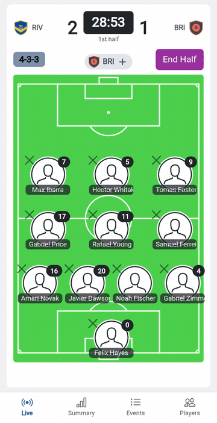
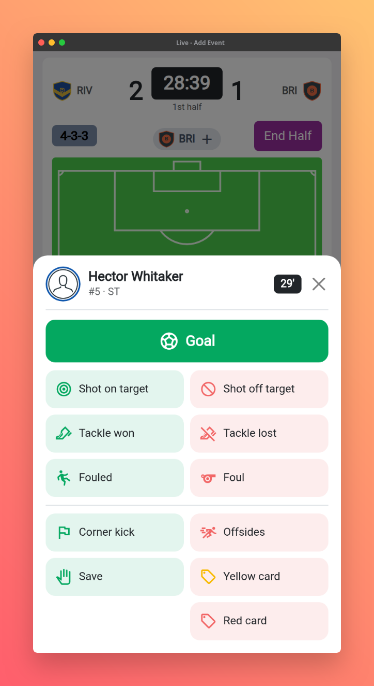
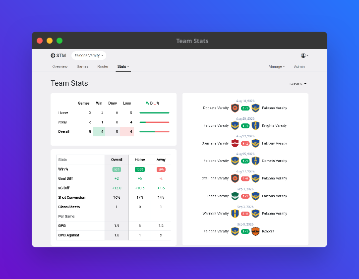

# Soccer Team Manager

**Track your team's games live from the sideline on your phone, then get the whole season's stats.**

Lineups, formations, live events, possession, penalty shootouts, xG and player ratings. Self-hosted, free and open source.

[](LICENSE)




## Who it's for

Coaches, club managers and the parent who always ends up keeping the
stats. If you've ever tracked a game on paper or in a notes app and then
typed it all into a spreadsheet, this replaces both.

## Features

- Live game tracking from your phone or tablet, including goals, shots, saves, substitutions, playing time, possession, penalty shootouts and more
- Live view for followers
- Game reports with momentum, possession and xG
- Head-to-head history and game previews
- Team, player, lineup, location and competition stats
- Player ratings and player of the game
- Rosters, guest players and formations
- Club and high school teams
- Admin and manager roles

## Screenshots

Live Game



Team Stats



## Installation

### Requirements

- PHP 8.2 or newer
- [Composer](https://getcomposer.org/)
- MySQL or MariaDB
- A web server (Apache or Nginx), or `php artisan serve` to try it out

The compiled CSS and JavaScript are included, so Node.js is only needed if
you change the front end (see [Development](#development)).

### Steps

1. **Clone the repository**

   ```bash
   git clone https://github.com/ryanhowdy/soccer-team-manager.git
   cd soccer-team-manager
   ```

2. **Install PHP dependencies**

   ```bash
   composer install
   ```

3. **Configure the environment**

   ```bash
   cp .env.example .env
   php artisan key:generate
   ```

   Then edit `.env`:
   - Set `DB_DATABASE`, `DB_USERNAME` and `DB_PASSWORD` to an empty database.
   - Set `APP_URL` to the address you'll use.
   - On a public server, set `APP_ENV=production` and `APP_DEBUG=false`.

4. **Create the database tables**

   ```bash
   php artisan migrate
   ```

5. **Link uploads** (club logos and player photos)

   ```bash
   php artisan storage:link
   ```

6. **Start it**

   ```bash
   php artisan serve
   ```

   Then open http://localhost:8000. For a permanent install, point your web
   server's document root at the `public/` folder instead.

### First login

1. Go to `/register` and create your account. **The first person to register
   becomes the admin**, and registration then closes. Do this straight after
   installing.
2. Set up your club, then your team. The app walks you through both on first
   login.
3. Add the formations you play under **Manage → Formations**. A new install
   has none, and you pick one when a game kicks off.
4. Add your players to a roster and schedule your games. On game day, press
   **Start Game** on the dashboard.

Add more people (other coaches, parents) on the **Admin** page.

## Updating

```bash
git pull
composer install
php artisan migrate
```

The version is shown in the footer.

## Development

```bash
composer install
npm install
npm run watch        # rebuild CSS/JS as you edit
php artisan serve
```

- Styles are in `resources/sass/` and scripts are in `resources/js/`. They're
  built with Laravel Mix.
- Run `npm run prod` before committing front end changes; the built files in
  `public/` are committed.

## Contributing

Issues and pull requests are welcome. If you use the app with your team, I'd
love to hear about it. Open an issue with feedback, a bug or a feature idea.

## License

[MIT](LICENSE)
